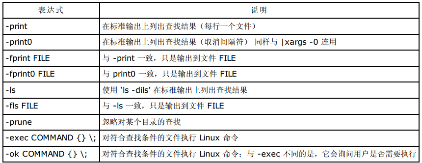

===========
文件查找
===========

find
=======

**1、find 命令的格式**

find 命令用于在文件系统中查找满足条件的文件。find 命令功能强大，提供了相当多的查找条件。find 命令还可以对查找到的文件做操作，如执行
Shell 命令等。

find 命令的格式是：

不带任何参数的 find 命令将在屏幕上递归显示当前目录下的文件列表。下面给出一些常用的表达式的解释。

**2、选项表达式**

**3、条件匹配表达式**

.. image:: ../_images/find/condition.png

.. image:: ../_images/find/condition2.png

.. image:: ../_images/find/condition3.png

**4、动作表达式**

**5、组合条件表达式**

在书写表达式时，可以使用逻辑运算符与、或、非组成的复合条件，并可以用()改变默认的操作符优先级。下面以优先
级由高到低列出可用的逻辑操作符。若以空格作为各个表达式的间隔符，则各个表示式之间是与关系。

.. image:: ../_images/find/combine.png

**6、find 命令使用举例**

.. image:: ../_images/find/eg1.png
.. image:: ../_images/find/eg2.png
.. image:: ../_images/find/eg3.png
.. image:: ../_images/find/eg4.png
.. image:: ../_images/find/eg5.png
.. image:: ../_images/find/eg6.png
.. image:: ../_images/find/eg7.png

1)find ./ -type f -name "*.txt" |xargs -i cp {} tmp/ 

2)用shell查询以“.”结尾的文件，并加上后缀“.ts”

find ./ -name "*." exec mv {} {}ats \;

3)查找所有具有suid的文件
 
  find / -perm -4100 -exec ls -l {} \;

  find / -type f -perm -u=s 

4)查找所有sgid的文件

find / -perm -2010 -exec ls -l {} \;

5)查找同时具有suid和sgid属性的文件

find / -perm -6110 -exec ls -l {} \;

	
6)find . -type f -perm 6000   #完全匹配

find . -type f -perm -6000  #有1的位置必须一样

find . -type f -perm +6000  #只要有其中一个有1的匹配就行

这些8进制的权限对比的时候要换成2进制形式)

	
7)查找含有sgid权限位的目录

find / -type f or type d -perm 2000

find / -type f or type d -perm -g=s

8)查找含有tickty权限位的目录

find / -type d -perm 1000 

9)查看危险目录
	
find / -perm -222 -type d 

find / -perm -o+w -tye d 

Locate
======

locate -r "ls$"

locate -r "^ls"

locate -r '^/bin.*ls$'

locate -r '.*/bin.*\<passwd$'  #<passwd 表示以passwd单词开头

locate -r '.*/bin.*\<passwd\>'  #包含passwd单词即可

	