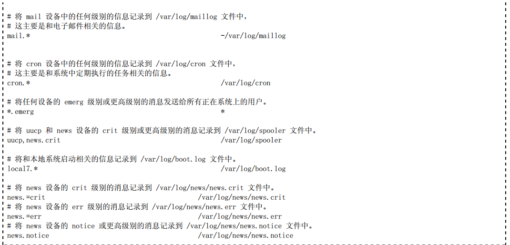
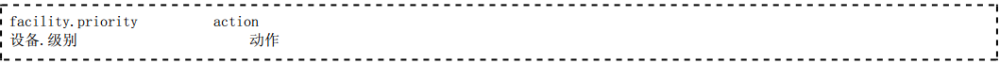
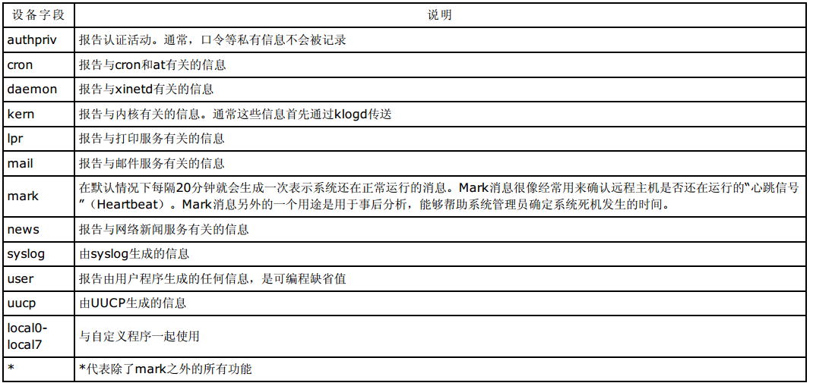
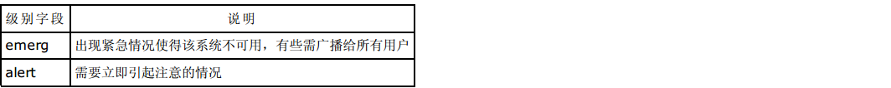
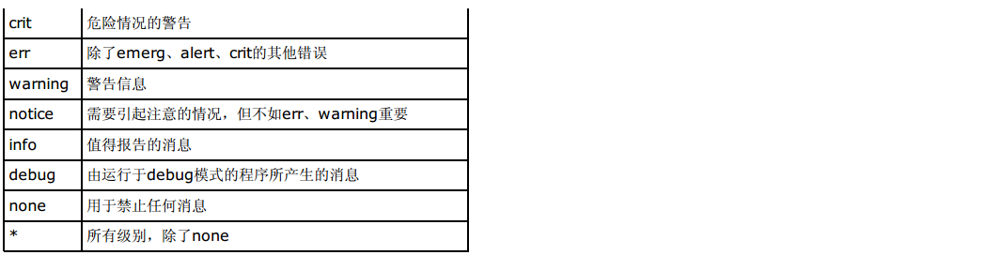
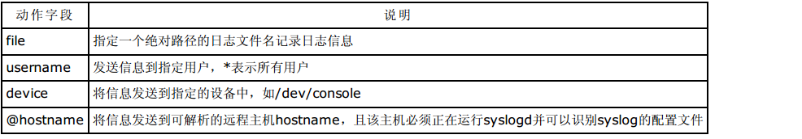
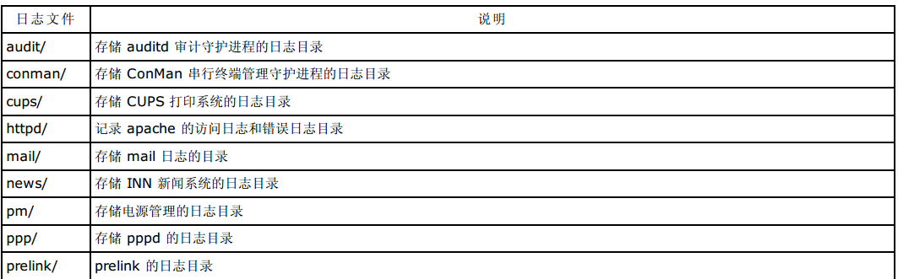
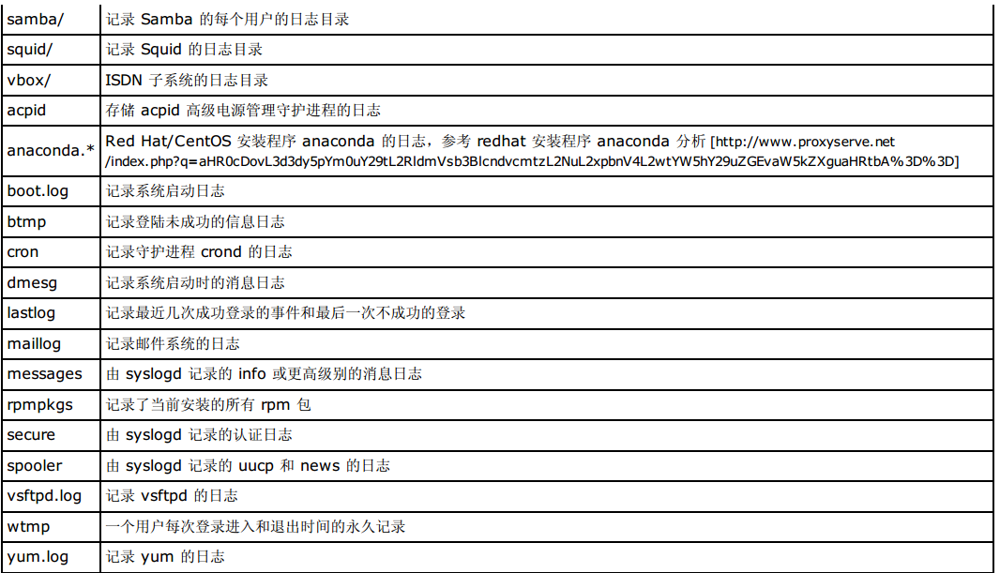
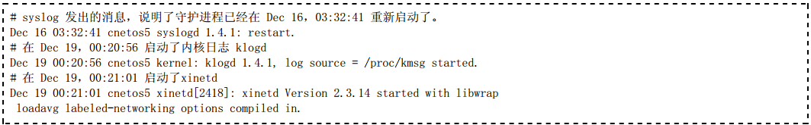
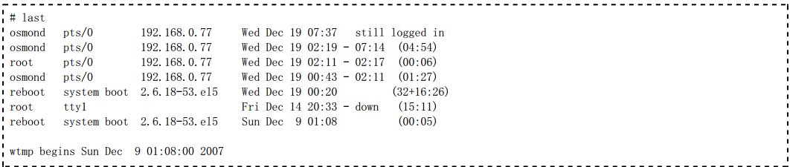

=========
syslog
=========

日志系统
=========

**1、什么是 syslog**

日志的主要用途是系统审计、监测追踪和分析统计。

为了保证 Linux 系统正常运行、准确解决遇到的各种各样的系统问题，认真地读取日志文件是管理员的一项非常重要的
任务。

Linux 内核由很多子系统组成，包括网络、文件访问、内存管理等。子系统需要给用户传送一些消息，这些消息内容包
括消息的来源及其重要性等。所有的子系统都要把消息送到一个可以维护的公用消息区，于是，就有了 syslog。

syslog 是一个综合的日志记录系统。它的主要功能是：方便日志管理和分类存放日志。 syslog 使程序设计者从繁重
的、机械的编写日志文件代码的工作中解脱出来，使管理员更好地控制日志的记录过程。在 syslog 出现之前，每个程
序都使用自己的日志记录策略。管理员对保存什么信息或是信息存放在哪里没有控制权。

syslog 能设置成根据输出信息的程序或重要程度将信息排序到不同的文件。例如，由于核心信息更重要且需要有规律
地阅读以确定问题出在哪里，所以要把核心信息与其他信息分开来，单独定向到一个分离的文件中。

管理员可以通过编辑 /etc/syslog.conf 来配置它们的行为。

**2、syslogd 的配置文件**

syslogd 的配置文件 /etc/syslog.conf 规定了系统中需要监视的事件和相应的日志的保存位置。使用如下命令：

可以查看此文件的内容为：

.. image:: ../_images/log/syslogconf1.png

该配置文件的每一行的格式如下：

其中：

1、设备字段用来指定需要监视的事件。它可取的值如下：

2、级别字段用于指明与每一种功能有关的级别和优先级。它可取的值如下：

3、动作字段用于描述对应功能的动作。它可取的值如下：

syslog 可以为某一事件指定多个动作，也可以同时指定多个功能和级别，它们之间用分号间隔。

查看日志
==========

1、常见的日志文件

日志文件通常存放在 /var/log 目录下。在该目录下除了包括 syslogd 记录的日志之外，同时还包含所有应用程序的
日志。

为了查看日志文件的内容必须要有 root 权限。日志文件中的信息很重要，只能让超级用户有访问这些文件的权限。
管理员可以使用下面的命令

.. image:: ../_images/log/lslog.png

查看系统中使用的日志文件，常用的日志文件如表所示。

2、查看文本日志文件

绝大多数日志文件是纯文本文件，每一行就是一个消息。只要是在Linux下能够处理纯文本的工具都能用来查看日志文
件。可以使用 cat、tac、more、less、tail 和 grep 进行查看。

下面以 /var/log/message s 为例，说明其日志文件的格式。

该文件中每一行表示一个消息，而且都由四个域的固定格式组成：

时间标签(Timestamp)：表示消息发出的日期和时间。

主机名(Hostname)：表示生成消息的计算机的名字。

生成消息的子系统的名字：可以是“Kernel”，表示消息来自内核或者是进程的名字，表示发出消息的程序的名字。

在方括号里的是进程的PID。

消息(Me ssage)，即消息的内容。

例如：

可以看出，实际上在 /var/log/message 文件中的消息都不是特别重要或紧急的。

3、查看非文本日志文件

也有一些日志文件是二进制文件，需要使用相应的命令进行读取。

1)lastlog

使用 lastlog 命令来检查某特定用户上次登录的时间，并格式化输出上次登录日志 /var/log/lastlog 的内容。例
如：

.. image:: ../_images/log/lastlog.png

2)last

last 命令往回搜索 /var/log/wtmp 来显示自从文件第一次创建以来登录过的用户。例如：

3)lastb

lastb 命令搜索 /var/log/btm p 来显示登录未成功的信息。例如：

.. image:: ../_images/log/lastb.png

4）who

who 命令查询 wtm p 文件并报告当前登录的每个用户。who 命令的缺省输出包括用户名、终端类型、登录日期及远程
主机。例如：

.. warning:: last 与lastlog的区别

last 指的是最近登录的记录，且只记录有登录记录的用户，没有登录的不记录，可能一个用户有多次登录记录，也包括正在登录的记录(正在登录的现实still login)

lastlog 记录最近一次用户登录的记录每个用户只有一条记录，切包括哪些没有登录的(显示Nerver Login )
   
.. warning:: utmp和wtmp的区别

/var/run/utmp   --  database of currently logged-in users

/var/log/wtmp  --  database of past user logins
   

5)其他查询命令

w命令查询utmp文件并显示当前系统中每个用户和它所运行的进程信息

ac命令根据当前的/var/log/wtmp文件中的登录进入和退出来报告用户连结的时间（小时）

users用单独的一行打印出当前登录的用户，每个显示的用户名对应一个登录会话