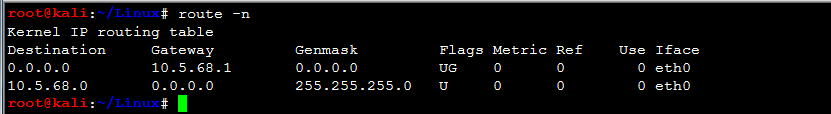
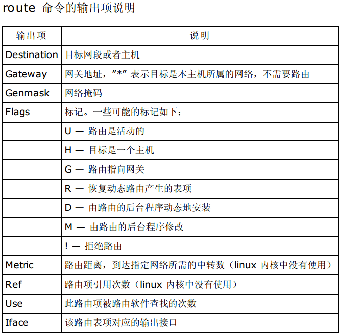

=======
路由篇
=======

查看Linux 内核路由(ipv4)
============================

1)route

或

route -n

2）ip route show 

3)ip route list table local

 ip route list table main

.. image:: ../_images/net/table-local.png

查看Linux 内核路由(ipv6)
===========================

1)route -n -6

2)route -A inet6 

3)ip -6 route show

4)ip -6 route show dev eth0

添加路由(ipv4)
=================

添加默认路由

1)ip route add default via 10.5.68.1 dev eth0 table test 

添加到主机的路由

2)route add -host 192.168.1.2 dev eth0:0

3)route add -host 10.20.30.148 gw 10.20.30.40

添加到网络的路由

4)route add -net 10.20.30.40 netmask 255.255.255.248 eth0

5)route add -net 10.20.30.48 netmask 255.255.255.248 gw 10.20.30.41

6)route add -net 192.168.1.0/24 eth1

添加路由(ipv6)
===============

1)ip -6 route add 2000::/3 via 3ffe:ffff:0:f101::1

2)route -A inet6 add 2000::/3 gw 3ffe:ffff:0:f101::1

3)ip -6 route add 2000::/3 dev eth0 metric 1

4)route -A inet6 add 2000::/3 dev eth0

5)route -A inet6 add default gw 2001:250:3000:2:2c0:95ff:fee0:473f

删除路由(ipv4)
==================

1)route del -host 192.168.1.2 dev eth0:0

2)route del -host 10.20.30.148 gw 10.20.30.40

3)route del -net 10.20.30.40 netmask 255.255.255.248 eth0

4)route del -net 10.20.30.48 netmask 255.255.255.248 gw 10.20.30.41

5)route del -net 192.168.1.0/24 eth1

6)route del default gw 192.168.1.1

删除路由(ipv6)
===================

1)ip -6 route del 2000::/3 via 3ffe:ffff:0:f101::1

2)route -A inet6 del 2000::/3 gw 3ffe:ffff:0:f101::1

3)ip -6 route del 2000::/3 dev eth0 

4)route -A inet6 del 2000::/3 dev eth0

刷新路由表
=============

ip route flush  cache 

三种路由类型
==============

主机路由

主机路由是路由选择表中指向单个IP地址或主机名的路由记录。主机路由的Flags字段为H。例如，在下面的示例中，
本地主机通过IP地址192.168.1.1的路由器到达IP地址为10.0.0.10的主机。

网络路由

网络路由是代表主机可以到达的网络。网络路由的Flags字段为N。例如，在下面的示例中，本地主机将发送到网络
192.19.12的数据包转发到IP地址为192.168.1.1的路由器。

.. image:: ../_images/net/network-route.png

默认路由

当主机不能在路由表中查找到目标主机的IP地址或网络路由时，数据包就被发送到默认路由（默认网关）上。默认路由
的Flags字段为G。例如，在下面的示例中，默认路由是IP地址为192.168.1.1的路由器。

设置路由转发
==============

1)临时生效

echo '1' >/proc/sys/net/ipv4/ip_forward

.. warning:: 重启后配置失效

2)永久生效

sysctl -w net.ipv4.ip_forward=1

或

echo "net.ipv4.ip_forward = 1" >>/etc/sysctl.conf

.. warning::  别忘记使用 sysctl -p 是配置生效

3)查看系统目前支不支持路由转发

sysctl net.ipv4.ip_forward
