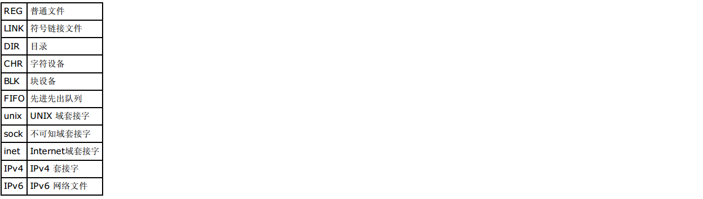

=========
工具篇
=========

工欲善其事必先利其器，go！

ps
========

ps 为我们提供了进程的一次性的查看，它所提供的查看结果并不动态连续的；如果想对进
程时间监控，应该用 top 工具；

使用ps，我们：

—可以确定有哪些进程正在执行和执行的状态

—进程是否结束、进程有没有僵死

—哪些进程占用了过多的系统资源等

ps默认显示当前终端进程

-a 包括所有终端的进程

-x 包括不属于终端的进程

-u 打印进程所有者信息

-f 选项显示进程的父进程

-e 含义同-a

-o 属性… 选项显示定制的信息：pid、comm、%cpu、%mem、state、tty、euser、ruser

-H 显示树状结构，表示程序间的相互关系

-c 列出程序时，显示每个程序真正的指令名称，而不包含路径，参数或常驻服务的标示。

-u xxx 显示指定用户的进程信息

-t<终端机编号>  指定终端机编号，并列出属于该终端机的程序的状况。

[wenjian@r520-85 ~]$ ps aux \|grep httpd

USER     PID    %CPU %MEM  VSZ   RSS  tty     STAT  TIME         COMMAND

wenjian  10383  0.0  0.0   4624  1628 ?        Ss   Aug01   0:05 httpd -k start

wenjian  10385  0.0  0.0   4768  1800 ?        S    Aug01   0:00 httpd -k start

wenjian  10386  0.0  0.0   4768  1796 ?        S    Aug01   0:00 httpd -k start

wenjian  10388  0.0  0.0   4768  1808 ?        S    Aug01   0:00 httpd -k start

wenjian  11706  0.0  0.0   4768  1804 ?        S    Aug01   0:00 httpd -k start

wenjian  11730  0.0  0.0   4768  1808 ?        S    Aug01   0:00 httpd -k start

wenjian  11741  0.0  0.0   4768  1800 ?        S    Aug01   0:00 httpd -k start

wenjian  22231  0.0  0.0   4768  1804 ?        S    Aug01   0:00 httpd -k start

wenjian  33806  0.0  0.0   4768  1764 ?        S    09:10   0:00 httpd -k start

wenjian  43835  0.0  0.0   4628  1372 ?        S    09:22   0:00 httpd -k start

wenjian  43926  0.0  0.0   4768  1788 ?        S    Aug01   0:00 httpd -k start

wenjian  45652  0.0  0.0 103240   876 pts/0    S+   09:24   0:00 grep httpd

USER域指明了是哪个用户启动了这个命令

PID表示进程号

%CPU 表示进程占用了多少CPU

%MEM 表示进程占用了多少内存

VSZ表示如果一个程序完全驻留在内存的话需要占用多少内存空间

RSS表示目前进程实际占用的内存大小

TTY表示进程从哪一个终端启动，不是从终端启动的进程则显示为 ? 

STAT表示当前进程的状态

	* D 不可中断 Uninterruptible（usually IO）

	* R 正在运行，或在队列中的进程

	* S 处于休眠状态

	* T 停止或被追踪

	* Z 僵尸进程

	* W 进入内存交换（从内核2.6开始无效）

	* X   死掉的进程
	* < 高优先级
	* n   低优先级
	* s   包含子进程
	* +   位于后台的进程组

top
==========

**1、top参数详解：**

top - 10:07:59 up 60 days, 18:02,  3 users,  load average: 1.58, 1.84, 1.30

Tasks: 517 total,   1 running, 516 sleeping,   0 stopped,   0 zombie

Cpu(s):  6.2%us,  0.3%sy,  0.0%ni, 93.5%id,  0.0%wa,  0.0%hi,  0.0%si,  0.0%st

Mem:  32830828k total, 24500432k used,  8330396k free,   307940k buffers

Swap: 35061752k total,    12516k used, 35049236k free,  6253084k cached

PID USER        PR  NI  VIRT    RES   SHR   S  %CPU  %MEM    TIME+  COMMAND    
                                                                                                
11517 radius    20   0  9228m   5.2g  10m   S  93.3  16.5   1908:32 /home/radius/jdk1.7.0_25/bin/java -Dserver=MemoryDB -Dserver.home=/home/radius/memdb2_wangxl -Ddb.poolname=

11140 radius    20   0  8969m   5.2g   10m  S  47.8  16.5   1909:07 /home/radius/jdk1.7.0_25/bin/java -Dserver=MemoryDB -Dserver.home=/home/radius/memdb_wangxl -Ddb.poolname=m

36802 radius    20   0  1396m   45m   10m   S  1.6   0.1    105:36.43 radius_3rj 10 d                        
                                                                    
26440 radius    20   0  1228m   995m   672  S  1.3   3.1    293:47.93 ./lm_rj2 -xx -d                      
                                                                      
41554 wenjian   20   0  9056   1408   1008  S  1.3   0.0   65:24.49 x_agent -c x_agent.ini -l 2 -e -d 2  
                                                                      
**统计信息区**

前五行是系统整体的统计信息。第一行是任务队列信息，同 uptime 命令的执行结果。其内容如下   
  
10:07:59  当前时间 

up  60 days, 18:02 系统运行时间，格式为时:分 

3 user 当前登录用户数 

load average: 1.58, 1.84, 1.30 系统负载，即任务队列的平均长度。
 
三个数值分别为 1分钟、5分钟、15分钟前到现在的平均值。 

第二、三行为进程和CPU的信息。当有多个CPU时，这些内容可能会超过两行。内容如下： 

Tasks: 29 total 进程总数 

1 running 正在运行的进程数 

28 sleeping 睡眠的进程数 

0 stopped 停止的进程数 

0 zombie 僵尸进程数 

Cpu(s): 0.3% us 用户空间占用CPU百分比 

1.0% sy 内核空间占用CPU百分比 

0.0% ni 用户进程空间内改变过优先级的进程占用CPU百分比 

98.7% id 空闲CPU百分比 

0.0% wa 等待输入输出的CPU时间百分比 

0.0% hi 

0.0% si

最后两行为内存信息。内容如下： 

Mem: 191272k total 物理内存总量 

173656k used 使用的物理内存总量 

17616k free 空闲内存总量 

22052k buffers 用作内核缓存的内存量

Swap: 192772k total 交换区总量 

0k used 使用的交换区总量 

192772k free 空闲交换区总量 

123988k cached 缓冲的交换区总量。 

内存中的内容被换出到交换区，而后又被换入到内存，但使用过的交换区尚未被覆盖， 

该数值即为这些内容已存在于内存中的交换区的大小。 

相应的内存再次被换出时可不必再对交换区写入。

PID 表示进程的进程号

USER 表示进程的用户

PR  表示进程的优先级

NI nice值。负值表示高优先级，正值表示低优先级 (-19 - 20 )

VIRT 进程使用的虚拟内存总量，单位kb。VIRT=SWAP+RES 

RES 进程使用的、未被换出的物理内存大小，单位kb。RES=CODE+DATA 

SWAP 进程使用的虚拟内存中，被换出的大小，单位kb。 

SHR 共享内存大小，单位kb 

%CPU 上次更新到现在的CPU时间占用百分比 

%MEM 进程使用的物理内存百分比 

TIME+ 进程使用的CPU时间总计，单位1/100秒

COMMAND 表示启动进程的命令

**2、top中快捷键**

> 向后翻页

<向前翻页

k 干掉一个进程，按下k命令之后，输入要kill的进程pid回车即可

h 查看帮助

r 调整进程优先级 ，输入完命令之后按提示操作即可

s 改变刷新的时间间隔 ，输入完命令之后按提示操作即可

r 调整一个进程的优先级

q 退出top

•t 显示摘要信息开关.

•m 显示内存信息开关.

•A 分类显示系统不同资源的使用，有助于快速识别系统中资源消耗多的任务

z 彩色/黑白显示开关

u 查看指定 按下u命令之后，界面提示输入用户名，输入即可

W 将当前的设置写入~/.toprc

=================================================================================

一个进程状态后面< 表示优先级高

N表示优先级低

**3、top 常用参数**

-u 只显示 指定用户的进程

-b批处理模式，可以使用这个参数将top输出重定向到文件中

-n top隔多久执行一次，一般和b结合用

-p pid 监控指定pid的进程

-u 监视指定用户的进程信息

pgrep
==========

1、pgrep -U wenjian -l

显示出所有用户名为wenjian的进程ID和对应的daemon 程序

2、pgrep -l httpd  

显示httpd的程序(包括主进程和子进程)的pid

3、pgrep -lo httpd 

列出最早启动的apache进程ID，也就是主进程的PID

-l表示显示pid对应的程序名

4、 pgrep -f httpd 和 pgrep  httpd效果一样

f参数可以匹配command中的关键字

5、pgrep -ln httpd

 列出最新启动的apache进程ID，-l 参数用来显示进程名称；

lsof
======

lsof（list open files） 是一个列出当前系统打开文件的工具。在linux环境下，任何事物都以文件的形式存在，通过文件不仅仅可以访问常规数据，还可以访问网络连接和硬件。

在终端下输入lsof即可显示系统打开的文件，因为 lsof 需要访问核心内存和各种文件，所以必须以 root 用户的身份运行它才能够充分地发挥其功能。

COMMAND    PID      USER   FD      TYPE     DEVICE     SIZE       NODE      NAME

init       1         root  cwd      DIR       3,3       1024       2         /

init       1         root  rtd      DIR       3,3       1024       2         /

init       1         root  txt      REG       3,3       38432      1763452  /sbin/init

init       1         root  mem      REG       3,3       106114     1091620  /lib/libdl-2.6.so

init       1         root  mem      REG       3,3       7560696    1091614  /lib/libc-2.6.so

init       1         root  mem      REG       3,3       79460      1091669  /lib/libselinux.so.1

init       1         root  mem      REG       3,3       223280     1091668  /lib/libsepol.so.1

init       1         root  mem      REG       3,3       564136     1091607  /lib/ld-2.6.so

init       1         root  10u      FIFO      0,15                  1309     /dev/initctl

每行显示一个打开的文件，若不指定条件默认将显示所有进程打开的所有文件。lsof输出各列信息的意义如下：

COMMAND：进程的名称

PID：进程标识符

USER：进程所有者

FD：文件描述符，应用程序通过文件描述符识别该文件。如cwd、txt等

TYPE：文件类型，如DIR、REG等

DEVICE：指定磁盘的名称

SIZE：文件的大小

NODE：索引节点（文件在磁盘上的标识）

NAME：打开文件的确切名称

其中FD 列中的文件描述符cwd 值表示应用程序的当前工作目录，这是该应用程序启动的目录，除非它本身对这个目录进行更改。

txt 类型的文件是程序代码，如应用程序二进制文件本身或共享库，如上列表中显示的 /sbin/init程序

其次数值表示应用程序的文件描述符，这是打开该文件时返回的一个整数。如上的最后一行文件/dev/initctl，其文件描述符为10

u 表示该文件被打开并处于读取/写入模式，而不是只读 ? 或只写 (w) 模式。

同时还有大写的W 表示该应用程序具有对整个文件的写锁.该文件描述符用于确保每次只能打开一个应用程序实例

初始打开每个应用程序时，都具有三个文件描述符，从 0 到 2，分别表示标准输入、输出和错误流。所以大多数应用程序所打开的文件的 FD 都是从 3 开始

与 FD 列相比，Type 列则比较直观。文件和目录分别称为 REG 和 DIR。而CHR 和 BLK，分别表示字符和块设备；或者 UNIX、FIFO 和 IPv4，分别表示 UNIX 域套接字、先进先出 (FIFO) 队列和网际协议 (IP) 套接字。

lsof 常见的用法是查找应用程序打开的文件的名称和数目。可用于查找出某个特定应用程序将日志数据记录到何处，或者正在跟踪某个问题。例如，linux限制了进程能够打开文件的数目。通常这个数值很大，所以不会产生问题，并且在需要时，应用程序可以请求更大的值（直到某个上限）。如果你怀疑应用程序耗尽了文件描述符，那么可以使用 lsof 统计打开的文件数目，以进行验证。lsof语法格式是：

lsof ［options］ filename

**1、常用的参数列表：**

**2、常用输出项**

.. image:: ../_images/process/lsof1.png

**3、常见的文件描述符**

**4、常见的文件类型（TYPE）**

**5、lsof使用实例**

1)查找谁在使用文件系统

在卸载文件系统时，如果该文件系统中有任何打开的文件，操作通常将会失败。那么通过lsof可以找出那些进程在使用当前要卸载的文件系统，如下：

# lsof  /GTES11/

COMMAND  PID USER   FD   TYPE DEVICE SIZE NODE NAME

bash    4208 root  cwd    DIR    3,1 4096    2 /GTES11/

vim     4230 root  cwd    DIR    3,1 4096    2 /GTES11/

2)查看22端口现在运行的情况

# lsof -i :22

COMMAND  PID USER   FD   TYPE DEVICE SIZE NODE NAME

sshd    1409 root    3u  IPv6   5678       TCP \*:ssh (LISTEN)

3)查看所属root用户进程所打开的文件类型为txt的文件:

# lsof -a -u root -d txt

COMMAND    PID USER  FD      TYPE DEVICE    SIZE    NODE NAME

init       1    root txt       REG    3,3   38432 1763452 /sbin/init

mingetty  1632 root txt       REG    3,3   14366 1763337 /sbin/mingetty

mingetty  1633 root txt       REG    3,3   14366 1763337 /sbin/mingetty

mingetty  1634 root txt       REG    3,3   14366 1763337 /sbin/mingetty

mingetty  1635 root txt       REG    3,3   14366 1763337 /sbin/mingetty

mingetty  1636 root txt       REG    3,3   14366 1763337 /sbin/mingetty

mingetty  1637 root txt       REG    3,3   14366 1763337 /sbin/mingetty

kdm        1638 root txt       REG    3,3  132548 1428194 /usr/bin/kdm

X          1670 root txt       REG    3,3 1716396 1428336 /usr/bin/Xorg

kdm        1671 root txt       REG    3,3  132548 1428194 /usr/bin/kdm

startkde  2427 root txt       REG    3,3  645408 1544195 /bin/bash

在这个示例中，用户root正在其/GTES11目录中进行一些操作。一个 bash是实例正在运行，并且它当前的目录为/GTES11，另一个则显示的是vim正在编辑/GTES11下的文件。要成功地卸载/GTES11，应该在通知用户以确保情况正常之后，中止这些进程。 这个示例说明了应用程序的当前工作目录非常重要，因为它仍保持着文件资源，并且可以防止文件系统被卸载。这就是为什么大部分守护进程（后台进程）将它们的目录更改为根目录、或服务特定的目录（如 sendmail 示例中的 /var/spool/mqueue）的原因，以避免该守护进程阻止卸载不相关的文件系统。

3)恢复删除的日志文件

当Linux计算机受到入侵时，常见的情况是日志文件被删除，以掩盖攻击者的踪迹。管理错误也可能导致意外删除重要的文件，比如在清理旧日志时，意外地删除了数据库的活动事务日志。有时可以通过lsof来恢复这些文件。

当进程打开了某个文件时，只要该进程保持打开该文件，即使将其删除，它依然存在于磁盘中。这意味着，进程并不知道文件已经被删除，它仍然可以向打开该文件时提供给它的文件描述符进行读取和写入。除了该进程之外，这个文件是不可见的，因为已经删除了其相应的目录索引节点。

在/proc目录下，其中包含了反映内核和进程树的各种文件。/proc目录挂载的是在内存中所映射的一块区域，所以这些文件和目录并不存在于磁盘中，因此当我们对这些文件进行读取和写入时，实际上是在从内存中获取相关信息。大多数与 lsof 相关的信息都存储于以进程的 PID 命名的目录中，即 /proc/1234 中包含的是 PID 为 1234
的进程的信息。每个进程目录中存在着各种文件，它们可以使得应用程序简单地了解进程的内存空间、文件描述符列表、指向磁盘上的文件的符号链接和其他系统信息。lsof 程序使用该信息和其他关于内核内部状态的信息来产生其输出。所以lsof 
可以显示进程的文件描述符和相关的文件名等信息。也就是我们通过访问进程的文件描述符可以找到该文件的相关信息

当系统中的某个文件被意外地删除了，只要这个时候系统中还有进程正在访问该文件，那么我们就可以通过lsof从/proc目录下恢复该文件的内容。 假如由于误操作将/var/log/messages文件删除掉了，那么这时要将/var/log/messages文件恢复的方法如下：

首先使用lsof来查看当前是否有进程打开/var/logmessages文件，如下：

# lsof \|grep /var/log/messages

syslogd   1283      root    2w      REG        3,3  5381017    1773647 /var/log/messages (deleted)

从上面的信息可以看到 PID 1283（syslogd）打开文件的文件描述符为 2。同时还可以看到/var/log/messages已经标记被删除了。因此我们可以在 /proc/1283/fd/2 （fd下的每个以数字命名的文件表示进程对应的文件描述符）中查看相应的信息，如下::

# head -n 10 /proc/1283/fd/2

Aug  4 13:50:15 holmes86 syslogd 1.4.1: restart.

Aug  4 13:50:15 holmes86 kernel: klogd 1.4.1, log source = /proc/kmsg started.

Aug  4 13:50:15 holmes86 kernel: Linux version 2.6.22.1-8 (root@everestbuilder.linux-ren.org) (gcc version 4.2.0) #1 SMP Wed Jul 18 11:18:32 EDT 2007

Aug  4 13:50:15 holmes86 kernel: BIOS-provided physical RAM map:

Aug  4 13:50:15 holmes86 kernel:  BIOS-e820: 0000000000000000 - 000000000009f000 (usable)

Aug  4 13:50:15 holmes86 kernel:  BIOS-e820: 000000000009f000 - 00000000000a0000 (reserved)

从上面的信息可以看出，查看 /proc/1283/fd/2 就可以得到所要恢复的数据。如果可以通过文件描述符查看相应的数据，那么就可以使用 I/O 重定向将其复制到文件中，如:

cat /proc/1283/fd/2 > /var/log/messages

对于许多应用程序，尤其是日志文件和数据库，这种恢复删除文件的方法非常有用。

kill与killall
==================

kill 和pid 在一起

1、kill -9 pid

-9表示强制终止信号

2、kill -s 9 pid

效果与1中等效

kill -s SIGKILL #SIGKILL与9信号等效

3、kill -HUP pid #重启进程

   kill -l HUP pid
   
   kill -1 pid
   
   三者等效
      
 4、 kill -TERM PPID 
 
     kill -15 PPID
	 
	 两者等效
	 
 给父进程发送一个TERM信号，试图杀死它和它的子进程。 
 
 
两者使用形式差不多，效果也差不多，写在一起

killall 与程序名一起

1、killall 程序名

psacct
====================

Redhat 系统操作系统用户进程监控记账的软件包为psacct，Debian 系列操作系统中相应的软件包则为acct，下面以Debian系列为例说明

管理员可以使用 acct 软件包提供的工具监视所有用户执行的命令，包括 CPU 时间和内存占用，实现进程记帐功能。acct 软件包提供了三个进程活动监视工具: ac, lastcomm 和 sa。

accton 用于打开或关闭进程记帐功能，它是运行 lastcomm 和 sa 命令的前提。accton 命令是一个开关，运行一次将打开进程记帐功能，再运行一次将关闭进程记帐功能。为了方便管理员

使用，安装acct软件包后系统提供一个 init 脚本执行 accton 命令，您可以使用如下的命令打开或关闭进程记帐功能。

service acct start

service acct stop

为避免进程记帐日志文件过大，通常在使用进程记帐功能时才打开，不用时就将其关闭。
默认情况下，acct 服务没有打开。

lastcomm 和 sa 命令默认从进程记帐文件 \/var\/log\/account\/acct 中读取数据，此文件为二进程文件。ac 命令从\/var\/log\/wtmp 文件中读取数据，此文件也为二进程文件。

lastcomm
------------

命令格式为

lastcomm 使用举例

lastcomm 输出字段说明

.. image:: ../_images/process/acct3.png

sa
---------------

sa命令从 /var/account/pacct 原始记帐数据文件中读取信息并进行信息汇总。

sa 命令的显示结果可以包含以下字段：

1. calls –– 命令的调用次数

2.记帐设备收集的信息：

	* re –– 实际使用时间（单位为分钟）。
	* cpu –– 通常简写为 cp，表示用户和系统时间之和（单位为分钟）。
	* k –– 平均 CPU 时间（单元的大小为1K）。
	* u –– 用户 CPU 时间（单位为分钟）。
	* s –– 系统 CPU 时间（单位为分钟）。

3. comm and –– 调用的命令。

不带任何参数的 sa 命令，将显示 calls、re、cpu、k 和 command 字段，以 CPU 字段排序。并将只用过一次的命令放在 ***other 类别中显示。

常用参数：

ac
------------

ac 命令及格式

ac 命令从 /var/log/wtm p 文件中的登录和退出时间记录计算并输出用户的连接时间和总计连接时间。

记帐文件 /var/log/wtm p 由 init 和 login 维护。ac 和 login 均不生成 /var/log/wtm p 文件。若记帐文件不存在，则不做记帐工作

常用参数

sysstat
============

syssta t 是 Linux 系统中的常用工具包。它的主要用途是观察服务负载，比如CPU和内存的占用率、网络的使用率以及磁盘写入和读取速
度等。

syssta t 工具包中包含两类工具：

	 * 即时查看工具：iosta t、m psta t、sar
	 * 累计统计工具：sar

也就是说，sar 具有这两种功能。因此，sar 是 syssta t 中的核心工具。

为了实现 sar 的累计统计，系统必须周期地记录当时的信息，这是通过调用 /usr/lib/sa/ 中的三个工具实现的：

	 * sa1 ：收集并存储每天系统动态信息到一个二进制的文件中，用作 sadc 的前端程序
	 * sa2 ：收集每天的系统活跃信息写入总结性的报告，用作 sar 的前端程序
	 * sadc ：系统动态数据收集工具，收集的数据被写入一个二进制的文件中，它被用作 sar 工具的后端

安装配置sysstat
------------------

以Debian 系统为例：

1、apt-get install sysstat

2、编辑 \/etc\/default\/sysstat、\/etc\/init.d\/sysstat、\/etc\/cron.d\/sysstat、\/etc\/cron.daily\/sysstat

将 ENABLE="false" 更改为 ENABLE="true"

3、service sysstat start 

sar
-----------

在使用 Linux 系统时，常常会遇到各种各样的问题，比如系统容易死机或者运行速度突然变慢，这时我们常常猜测：是否硬盘空间不足，
是否内存不足，是否 I\/O 出现瓶颈，还是系统的核心参数出了问题？这时，我们应该考虑使用 sar 工具对系统做一个全面了解，分析系统
的负载状况。

sar（System Activity Reporter）是系统活动情况报告的缩写。sar 工具将对系统当前的状态进行取样，然后通过计算数据和比例来表
达系统的当前运行状态。它的特点是可以连续对系统取样，获得大量的取样数据；取样数据和分析的结果都可以存入文件，所需的负载很
小。 sar 是目前 Linux 上最为全面的系统性能分析工具之一，可以从多方面对系统的活动进行报告，包括：文件的读写情况、系统调用的
使用情况、磁盘I\/O、CPU效率、内存使用状况、进程活动及IPC有关的活动等。为了提供不同的信息，sar 提供了丰富的选项、因此使用
较为复杂。

**I、sar 的命令格式**

.. image:: ../_images/process/sar.png

其中：

	 * interval : 为取样时间间隔
	 * count : 为输出次数，若省略此项，默认值为 1

常用选项：

**II、sar 使用举例**

.. image:: ../_images/process/sareg1.png

.. image:: ../_images/process/sareg2.png

.. image:: ../_images/process/sareg4.png

.. image:: ../_images/process/sareg5.png

.. image:: ../_images/process/sareg6.png

.. image:: ../_images/process/sareg7.png

.. image:: ../_images/process/sareg10.png

.. image:: ../_images/process/sareg11.png

.. image:: ../_images/process/sareg14.png

.. image:: ../_images/process/sareg15.png

.. image:: ../_images/process/sareg16.png

iostat
----------

.. image:: ../_images/process/io1.png

mpstat
----------

.. image:: ../_images/process/mp3.png

.. image:: ../_images/process/mp4.png