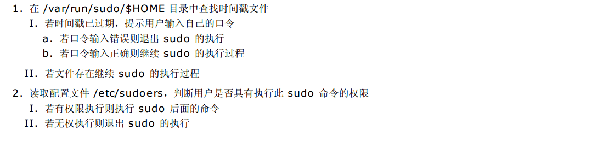

==========
配置命令
==========

账户管理命令
===============

组管理
----------

**1、groupadd**

groupadd  用于添加组账号。格式如下：

其中：

 * GROUP：是要添加的组名
 * -g：用于指定 GID，默认为使用当前最大的 GID 加1

**2、groupmod **

groupmod  用于修改系统已存在的组账号。格式如下：

.. image:: ../_images/user/groupdel.png

其中：

GROUP：为要修改的组账户名

常用选项：

 * -g GID：重新指派 GID

 * -n NEW_GROUP：更改组名为 NEW_GROUP

**3、groupdel**

groupdel  用于删除系统已存在的组账号。格式如下：

.. image:: ../_images/user/groupdel.png

**4、groups** 

查看当前用户所属用户组

**5、grpck**

检查用户组配置文件

**6、chgrp**

修改文件所属组

**7、vigr**

安全编辑 /etc/group 文件(编辑的时候锁定文件)

**8、newgrp**

切换用户组

用户管理
------------

**1、useradd**

useradd 用于添加用户账号或设置添加用户使用的默认信息。格式如下：

说明：

 * 格式1：用于添加用户账号，LOGIN 为用户登录账号
 * 格式2：用于显示添加用户使用的默认信息
 * 格式3：用于设置添加用户使用的默认信息

添加用户选项：

改变用户默认值选项：

2、usermod

usermod 用于修改系统已存在的组账号。格式如下：

其中：

 * LOGIN：为要修改的用户账号名
 * 选项：-c、-d、-e、-f、-g、-G、-s、-u 的含义与 useradd 选项的含义相同
 * 添加了如下选项：
	 * -l NEW_LOGIN：更改用户登录名为 NEW_LOGIN
	 * -L：锁定用户账号
	 * -U：对用户账号解除锁定

**3、userdel**

userdel  用于删除系统已存在的组账号。格式如下：

.. image:: ../_images/user/userdel.png

其中：

 * LOGIN：为要删除的用户账号名
 * -r：同时删除用户的自家目录和 m ail 的假脱机文件

**4、pwck**

用来检测/etc/passwd 文件

**5、vipw **

安全编辑/etc/passwd (编辑的时候锁定文件)

**6、id**

查看用户id和组信息

**7、finger **

查看用户详细信息

**8、su **

切换用户 (su - 表示切换用户环境)

**9、passwd -S**

查看当前用户密码状态

**10、who、w **

查看用户登录状态

口令管理
==============

**1、 passwd 命令管理口令**

创建了用户账户之后，还要给新用户设置口令。设置用户口令的命令是 passwd

.. image:: ../_images/user/passwd-ma.png

**2、口令时效**

目前已有更强大的硬件大大地缩短了利用自动运行的程序来猜测口令的时间。口令时效是系统管理员用来防止机构内不
良口令的一种技术。防止口令被攻击的方法就是要经常地改变口令。为安全起见，要求用户定期改变他们的口令是明智
之举。口令时效意味着过了一段预先设定的时间后，用户会被提示创建一个新口令。它所根据的理论是，如果用户被强
制定期改变口令，某个破译的口令对入侵者来说就只有有限的利用机会。这种用来强制用户在一段时间之后更改口令的
机制称为口令时效。

2.1 设置新添用户的口令时效

通过编辑 /etc/login.de fs，可以指定几个参数，来设置口令实效的默认设定：

.. image:: ../_images/user/passwd-time.png

2.2 一句话修改密码

	echo "password″|passwd –stdin user

	echo "user:password"|chpasswd

2.3 添加一个root权限的用户

    useradd -m -o -u 0 -g 0 hacker 

=========================================================================================================================================

 * PASS_MAX_DAYS：设定在多少天后要求用户修改口令。默认口令时效的天数为99999，即关闭了口令时效。更明智的设定一般是60天（每2个月）强制更改一次口令。
 * PASS_MIN_DAYS：设定在本次口令修改后，下次允许更改口令之前所需的最少天数。
 * PASS_MIN_LEN ：设定口令的最小字符数。
 * PASS_WARN_AGE：设定在口令失效前多少天开始通知用户更改口令（一般在用户刚刚登陆系统时就会收到警告通知）。

也可以编辑 /etc/default/useradd 文件中 INACTIVE 和 EXPIRE 的设置。

.. image:: ../_images/user/passwd-time2.png

=========================================================================================================================================

 * INACTIVE：指明在口令失效后多久时间内，如果口令没有进行更改，则将账户更改为失效状态。默认值为 -1，即关闭了口令时效。更明智的设定一般是60天（每2个月）强制更改一次口令。
 * EXPIRE：为设置所有新用户设定一个口令失效的明确时间（具体格式为“YYYY-MM-DD”）。

设置已存在用户的口令时效

对系统已存在用户设置口令时效是通过 chage 

=============================================================s============================================================================

 * 也可以使用chage <用户名>进入交互模式修改用户的口令时效。
 * 使用chage命令实质上是修改影子口令文件/e tc/shadow中的与口令时效相关的字段值。
 * chage命令仅仅适用于本地系统账户，对LDAP账号和数据库账号不起作用。

制定一项策略，定义多长时间一个口令必须进行更改，然后强制执行该策略，是非常不错的一个做法。在解雇了某个雇
员后，口令时效策略会保证该雇员不可能在被解雇3个月后发现他的口令依然可用。即使系统管理员忽略了删除他的帐
号，该帐号也会因口令时效策略而被自动锁定。当然，这一点并不能成为不及时删除该雇员帐号的理由，但是这个策略
的确提供了一层额外的安全防护，尤其是在过去常常忽视及时清理帐号的情况下。

用户状态切换
===============

系统管理员应该养成良好的习惯：以一个普通用户登录系统进行不同操作，当需要超级用户身份进行系统管理时再切换超级用户执行
系统管理命令。有如下两种方式：

 * su

	 * 直接切换为超级用户
	 * 普通用户要切换为超级用户必须知道超级用户的口令
	 * 适用于系统中只有单个系统管理员的情况

 * sudo
	 * 直接使用 sudo 命令前缀执行系统管理命令
	 * 执行系统管理命令时无需知道超级用户的口令，使用普通用户自己的口令即可
	 * 由于执行系统管理命令时无需知晓超级用户口令，所以适用于系统中有多个系统管理员的情况，因为这样不会泄露超级用户口令。当然系统只有单个系统管理员时也可以使用。

su
---------

su 用于切换当前用户到指定的用户账号，命令的格式如下：

.. image:: ../_images/user/su.png

例子

.. image:: ../_images/user/eg2.png

sudo
--------

sudo 允许系统管理员（root）为几个用户或组委派权利，使之能运行部分或全部由 root （或另一个）用户执行的命令。sudo
设计者的宗旨是：给用户尽可能少的权限但仍允许完成他们的工作。sudo 是设置了 SUID 位的执行文件。

**1、sudo 具有以下特点：**

 * sudo 能够限制指定用户在指定主机上运行某些命令。
 * sudo 可以提供日志，忠实地记录每个用户使用sudo做了些什么，并且能将日志传到中心主机或者日志服务器。
 * sudo 为系统管理员提供配置文件，允许系统管理员集中地管理用户的使用权限和使用的主机。它默认的存放位置是 /etc/sudoers。
 * sudo 使用时间戳文件来完成类似“检票”的系统。当用户执行 sudo 并且输入密码后，用户获得了一张默认存活期为5分钟的“入场券”（默认值可以在编译的时候改变）。超时以后，用户必须重新输入密码。

**2、用户执行 sudo 的执行过程：**

**3、sudo 命令的格式**

sudo 命令的格式为：

其中：

 * -V : 显示版本信息，并退出。
 * -h : 显示帮助信息。
 * -l : 显示当前用户（执行 sudo 的使用者）的权限，只有在 /e tc/sudoers 里的用户才能使用该选项。
 * -v : 延长密码有效期限5分钟。
 * -k : 将会强迫使用者在下一次执行 sudo 时问密码（不论有没有超过 5 分钟）。
 * -H : 将环境变数中的 $HOME 指定为要变更身份的使用者家目录（如不加 -u 参数就是 /root ） 。
 * -b : 在后台执行指令。
 * -u username|#uid : 以指定的用户作为新的身份。身略此参数表示以 root 的身份执行指令。
 * -i : 模拟一个新用户身份的初始 Shell。
 * -s : 执行环境变量 $SHELL 所指定的 shell ，或是 /e tc/passwd 里所指定的 shell。
 * command : 为以新用户身份要执行的命令。

**4、配置 sudo**

默认情况下，只有 root 用户可以使用 sudo 命令。要分派其他用户使用 sudo 命令，需要修改配置文件 /e tc/sudoers，下面
是 CentOS 默认的 配置文件 /etc/sudoers：

.. image:: ../_images/user/sudoers.png

root 用户可以使用如下命令修改 sudo 的配置文件 /etc/sudoers ：

.. image:: ../_images/user/visudo.png

上面的命令将启动 vi 编辑文件 /e tc/sudoers。之所以使用 visudo 有两个原因：一是它能够防止两个用户同时修改它；二是它
也能进行有限的语法检查。

/etc/sudoers 文件的语法相对复杂，详细说明请参见其手册 m an sudoers，下面做简单说明：

/etc/sudoers 中的特殊字符和保留字：

/etc/sudoers 的组成部分：

1(别名定义部分：包括 User_Alias, Host_Alias, Runas_Alias, Cmnd_Alias

2)配置选项部分：由De faults 设置

3)权限分配部分：这是整个配置文件的核心部分，其格式为：

.. image:: ../_images/user/sudoersconfig2.png

说明：

 * 在 Cmnd 部分之前可以使用 NOPASSWD: 参数，表示不用输入密码即可执行 Cm nd
 * (Runas) 部分可以省略，省略时表示 (root) ，即表示仅能切换为 root 用户身份
 * 四个部分均可设置多个项目，每个项目用逗号间隔
 * 四个部分均可使用别名定义来简化配置，即用 User_Alias 定义用户别名、用 Host_Alias 定义主机别名、用 Runas_Alias定义切换用户别名、用 Cmnd_Alias 定义命令别名。别名必须使用大些字母。这些别名语句的格式为：

.. image:: ../_images/user/alias.png

下面给出一些配置片段：

.. image:: ../_images/user/configeg.png

