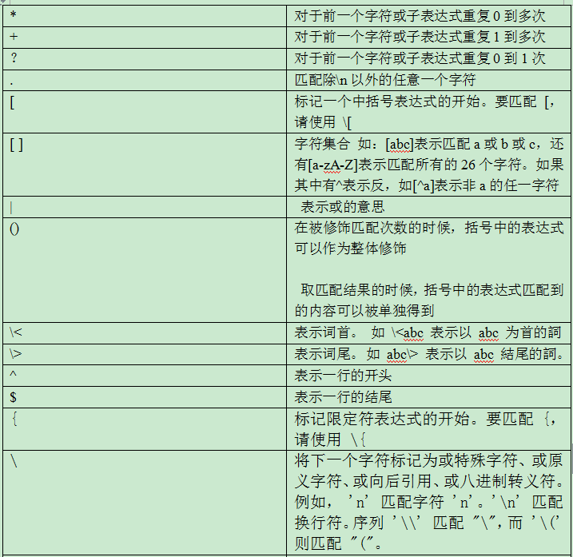
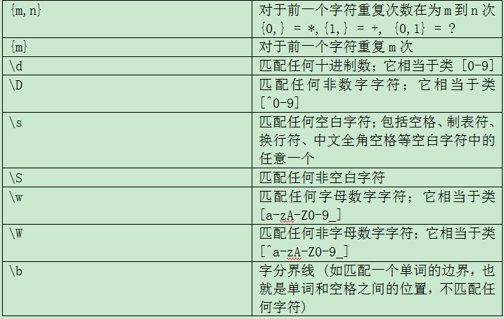
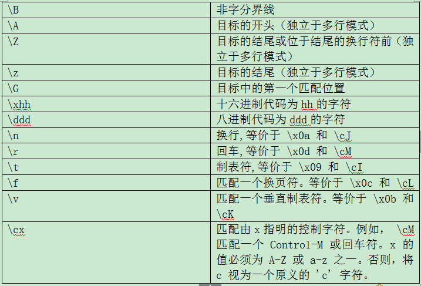

=============
正则表达式
=============

正则表达式定义
------------------

正则表达式(regular expression)是一串字符串，描述了一种字符串匹配的模式，可以用来检查一个串是否含有某种子串、将匹配的子串做替换或者从某个串中取出符合某个条件的子串等

正则表达式是由普通字符以及特殊字符组成的文字模式。正则表达式作为一个模板，将某个字符模式与所搜索的字符串进行匹配。

正则表达式是使用某种模式（patte rn）去匹配（m atching）一类字符串的一个公式。通常使用正则表达式进行查找、替换等操作

有两种风格的正则表达式：

POSIX 风格的正则表达式  

Perl 风格的正则表达式（Perl-compatible regular expression）

也有基本正则表达式和扩展正则表达式之分

正则表达式引擎
--------------------------

正则表达式引擎的内部工作机制是什么呢？我们有的时候会碰到当使用正则表达式的时候很多的结果并不是我们想要的，那么其原因是什么呢？那么这里就会给你一个答案：

了解正则表达式引擎的必要性：

知道正则表达式引擎是如何工作的有助于你很快理解为何某个正则表达式不像你期望的那样工作。

正则表达式引擎的种类：

有两种类型的引擎：文本导向(text-directed)的引擎和正则导向(regex-directed)的引擎。Jeffrey Friedl把他们称作DFA和NFA引擎。本文谈到的是正则导向的引擎。这是因为一些非常有用的特性，如“惰性”量词(lazy quantifiers)和反向引用(backreferences)，只能在正则导向的引擎中实现。所以毫不意外这种引擎是目前最流行的引擎。

你可以轻易分辨出所使用的引擎是文本导向还是正则导向。如果反向引用或“惰性”量词被实现，则可以肯定你使用的引擎是正则导向的。你可以作如下测试：将正则表达式<<regex|regex not>>应用到字符串“regex not”。如果匹配的结果是regex，则引擎是正则导向的。如果结果是regex not，则是文本导向的。因为正则导向的引擎是“猴急”的，它会很急切的进行表功，报告它找到的第一个匹配 。

正则表达式引擎的小小总结：

正则导向的引擎总是返回最左边的匹配，这是需要你理解的很重要的一点：即使以后有可能发现一个“更好”的匹配，正则导向的引擎也总是返回最左边的匹配。

当把<<cat>>应用到“He captured a catfish for his cat”，引擎先比较<<c>>和“H”，结果失败了。于是引擎再比较<<c>>和“e”，也失败了。直到第四个字符，<<c>>匹配了“c”。<<a>>匹配了第五个字符。到第六个字符<<t>>没能匹配“p”，也失败了。引擎再继续从第五个字符重新检查匹配性。直到第十五个字符开始，<<cat>>匹配上了“catfish”中的“cat”，正则表达式引擎急切的返回第一个匹配的结果，而不会再继续查找是否有其他更好的匹配。

正则表达式引擎的相关内容就向你介绍到这里，希望你对正则表达式引擎有所了解。

正则中的特殊字符
-------------------

所谓特殊字符，就是一些有特殊含义的字符，如*

其中 ^ $ . * [] \{n\} \{n,m\} \{n,\} \\  为基本正则表达式的元字符

? + () {n} {n,} {n,m} | 为扩展正则表达式元字符

正则表达式
-------------------

通配符和正则的区别

在通配符中* 表示0个或任意多个字符，?表示任意一个字符

在正则中 * 对于前一个字符重复0到无穷次,?对于前一个字符重复0到1次

sql中的通配符% 表示 0个或者任意多个字符,_ 表示任意单个字符

正则速记卡
--------------

.. image:: _images/card.png
