=======================
modsecrity防护案例
=======================

modsecurity防护暴力破解攻击
------------------------------

缓解暴力破解攻击的思路如下：

 * 1、更改默认管理员账号，或者干脆删除默认管理员，新添加一个管理员账号
 * 2、使用双因子认证，比如说辅助使用手机验证码
 * 3、限制指定IP登录
 * 4、使用.htaccess额外增加一层登录认证
 * 5、统计指定IP单位时间内登录失败次数(一般response body中会含有登录失败标记，如 Incorrect password等)
 

 
 这里就介绍一下用ModSecurity V2.7.3来保护Wordpress，防止暴力破解

 I、Wordpress的登录过程分析

 下图为Wordpress的登录页面：

 .. image:: ../_images/modsecurity/wordpress.png

 用户登录之后，发送请求到WP-loing.php页面，HTTP请求包内容如下：

 .. image:: ../_images/modsecurity/login.png
 
 payload部分包含了用户名和密码，以及登录成功后转向的页面。OK，了解数据包结构之后，我们可以创建规则，防止未经授权的访问。

 II、检查Rerfer

 正常的用户登录Wordpress，在数据包头部会包含一个Referer字段，但是通过人工编写的程序，很多不会包含Referer字段，直接发送登录请求到wp-login.php页面，所以，我们可以根据此创建一个ModSecurity规则来检查Rerfer字段信息：

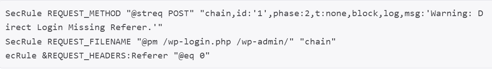

当然通过脚本，很容易实现Rerfer伪造，所以还需要接下来的规则一起配合。

III、限制访问的IP

如果你不想修改默认管理员帐号，可以添加一个规则只允许特定的IP访问管理页面，如下：

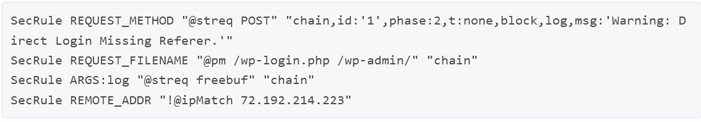

在这个例子里，只允许名称为freebuf的管理员帐户通过72.192.214.223的IP地址来访问。

IV、跟踪管理员帐户的登录尝试

我们可以通过ModSecurity的规则来block掉恶意IP，以下为登录失败的返回包：

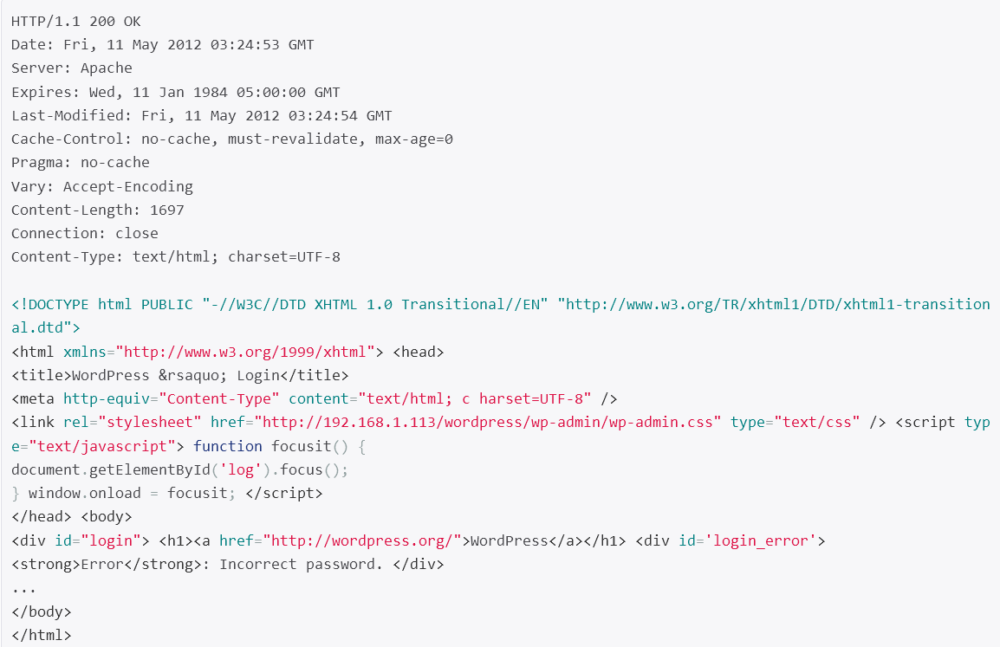

可以看到状态码为200，而且返回的数据包中包含了Incorrect password，据此可以创建以下规则：

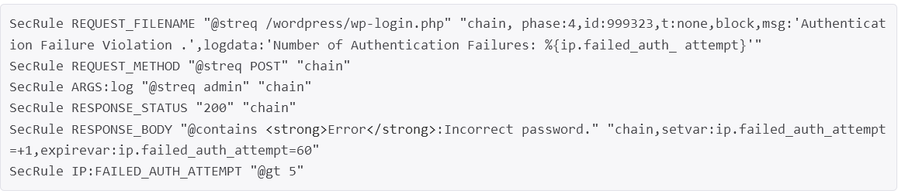

V、设置验证请求的次数

ModSecurity可以在指定的时间内跟踪请求的数量，设置阀值来进行阻断攻击，在它的规则集里已经个包含了该规则，modsecurity_crs_10_setup.conf

如下：

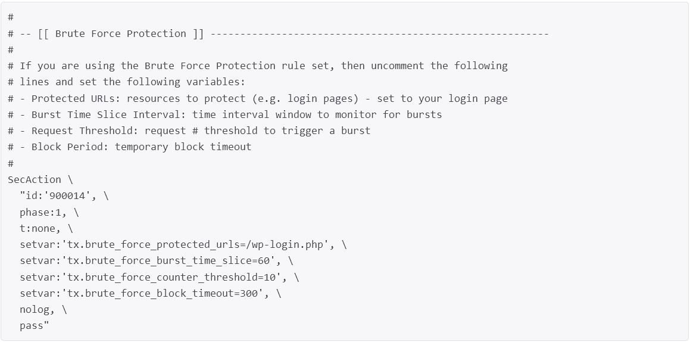

注意修改 setvar:’tx.brute_force_protected_urls=/wp-login.php‘,

设置完毕后，激活modsecurity_crs_11_brute_force.conf

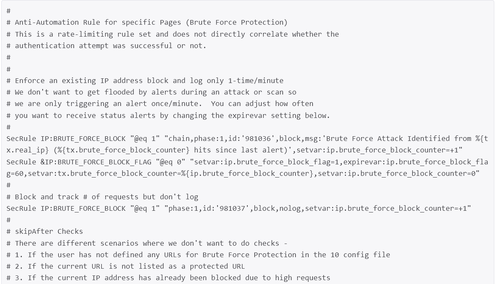

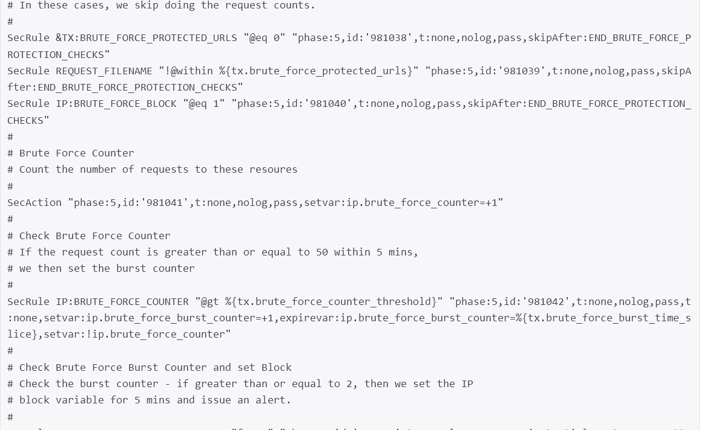

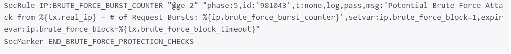

VI、使用SecGuardianLog

从 1.9版本后，ModSecurity 支持一个新的指令，SecGuardianLog，设计此指令用于把所有允许数据通过管理日志功能发送到另一个程序。自从 apache部署成典型的多进程方式，信息共享变得困难了，这一想法就是部署一个独立的外部进程使用状态机的方式去观察所有的请求，提供额外的保护。使用方法如下：

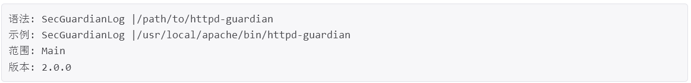

而且SecGuardianLog也可以和 SnortSam协同工作（http://www.snortsam.net）。如果已经配置过 httpd-guardian(具体介绍请查看源代码)你只需要在 apache配置中添加一行就可以部署它：

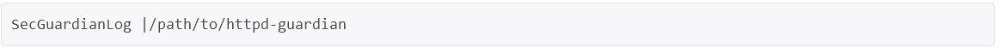

规则如下：

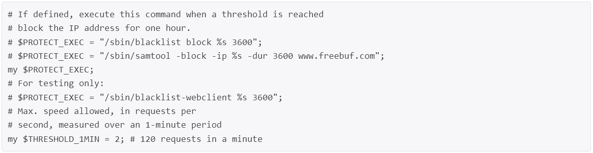

跟踪httpd守护进程数量，如果超过了限制，可以执行一些操作，如封锁IP一小时。 
