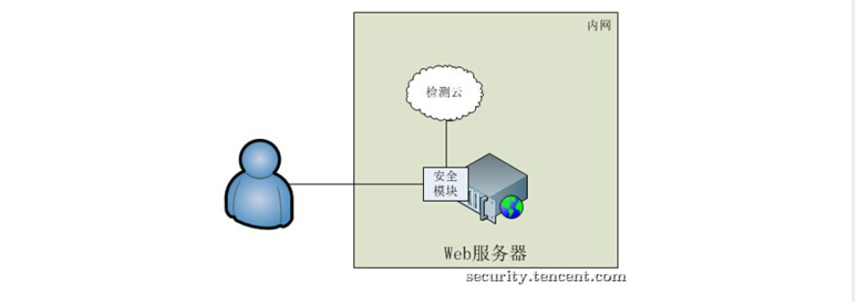
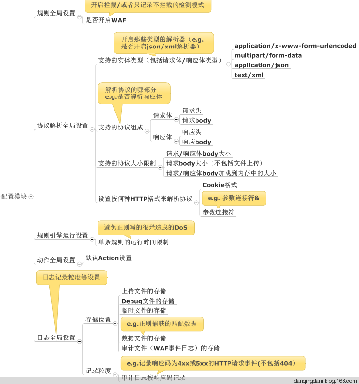
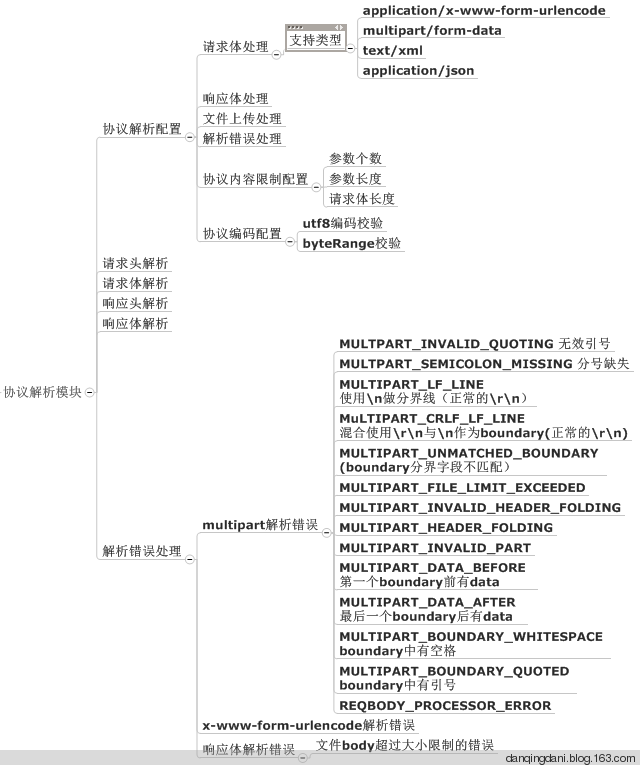
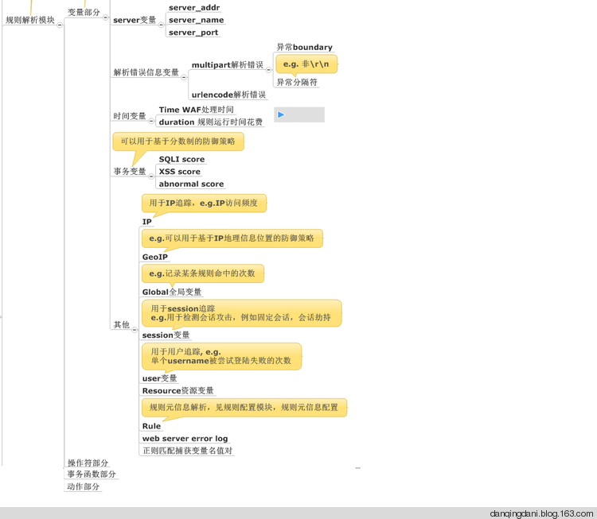
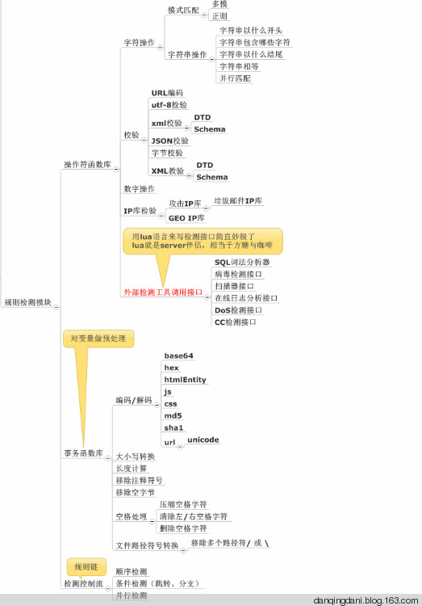
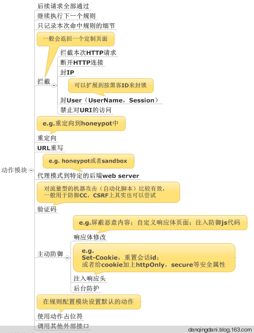
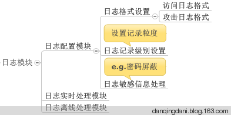
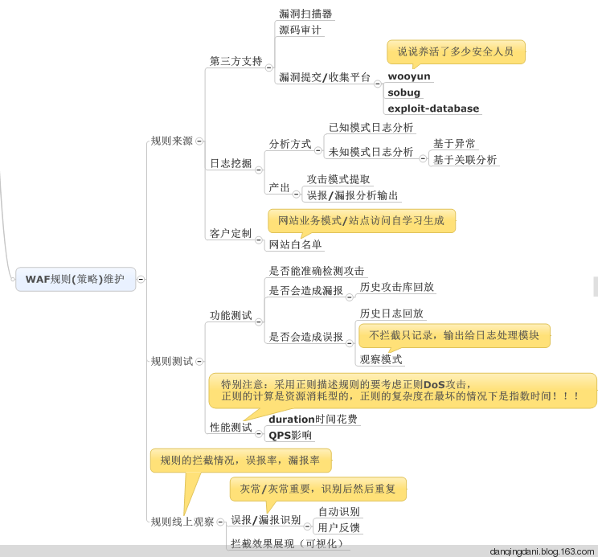
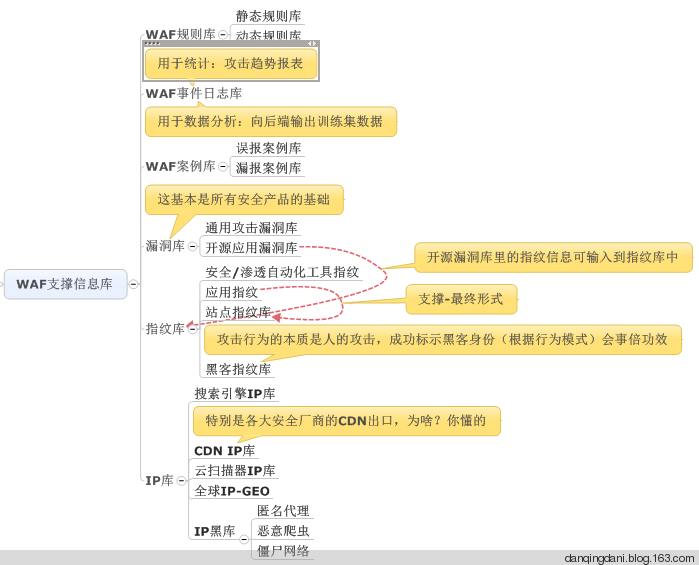

============
WAF基本功
============

主要整理了WAF基本知识，算是科普吧

什么是WAF
=============

Web Application Firewall, 简称：WAF

代表了一类新兴的信息安全技术，用以解决诸如防火墙一类传统设备束手无策的Web应用安全问题。与传统防火墙不同，WAF工作在应用层，因此对Web应用防护具有先天的技术优势。
基于对Web应用业务和逻辑的深刻理解，WAF对来自Web应用程序客户端的各类请求进行内容检测和验证，确保其安全性与合法性，对非法的请求予以实时阻断，从而对各类网站站点进行有效防护。

WAF被需要的原因
===================

WEB服务器以其强大的计算能力、处理性能及蕴含的较高价值逐渐成为主要攻击目标。SQL注入、网页篡改、网页挂马等安全事件，频繁发生。
要彻底解决此类漏洞的代码审计和代码修补往往需要较长的时间，由此产生了WAF（Web应用防护系统）

WAF的分类
=============

**1、从定义上分类**

1)硬件WAF

以传统安全厂商的WAF产品为例，如绿盟、启明的WAF产品

2)软件WAF

 * ModSecurity ：开源WAF，可作为apache的一个模块

 * phpids ：为PHP应用设计的WAF系统

 * WebKnight ：集成到IIS的过滤器

3)代码级WAF

使用脚本语言实现的过滤器模式

这种机制本质上属于应用程序安全架构的范畴，它是遵循安全编码最佳实践的产物。就PHP Web应用来说，可以在php.ini中修改：

::

; Automatically add files before PHP document.
; auto-prepend-fileauto_prepend_file =
; Automatically add files after PHP document.
; auto-append-fileauto_append_file =

配置指令，这些指令指向那些在每个请求的PHP脚本执行"之前"和"之后"才执行的PHP文件。这样就可以在各种HTTP请求集合(GET,POST,COOKIE)之前对数据进行一些前发处理。

一些开源的web框架如CodeIgniter 会采用一些Global Routing全局路由机制来改变原本的HTTP交互流程，从而使程序猿有机会hook住一些关键的处理逻辑，在进入核心代码前对用户发送的数据进行处理。

http://codeigniter.org.cn/user_guide/general/routing.html

还可以使用web应用的编程语言来实现过滤器。模块代码可以在请求和响应阶段之间进行执行。

**2、从WAF架构上分类**

1)本机服务默默快模式

通过在Apache，IIS等Web服务器内嵌实现检测引擎，所有请求的出入流量均先经过检测引擎的检测，如果请求无问 题则调用CGI处理业务逻辑，如果请求发现攻击特征，再根据配置进行相应的动作。
以此对运行于Web服务器上的网站进 行安全防护。著名的安全开源项目ModSecurity及naxsi防火墙就是此种模式。

优点：
	I、网络结构简单，不需要改变网络拓扑，只需要部署Web服务器的安全模块
      
	II、无单点故障

	III、加密或压缩内容没问题。许多IDS系统分析SSL流量的时候很困难，但对于如ModSecurity这样内嵌模式工作的waf没有麻烦，因为它工作于已解密和解压的数据环节。

挑战：

	I、维护困难。当有大规模的服务器集群时，任何更新都涉及到多台服务器。

	II、需要部署操作，在面临大规模部署时成本较高。

	III、无集中化的数据中心。针对安全事件的分析往往需要有集中式的数据汇总，而此种模式下用户请求数据分散在各个Web服务器上。

2)反向代理模式

使用这种模式的方案需要修改DNS，让域名解析到反向代理服务器。当用户向某个域名发起请求时，请求会先经过反 向代理进行检测，检测无问题之后再转发给后端的Web服务器。
这种模式下，反向代理除了能提供Web安全防护之外， 还能充当抗DDoS攻击，内容加速（CDN）等功能。云安全厂商CloudFlare采用这种模式。

优点： 
	I、集中式的流量出入口。可以针对性地进行大数据分析。
	
	II、部署方便。可多地部署，附带提供CDN功能。

挑战：
	I、动态的额外增加一层。会带来用户请求的网络开销等。 

	II、站点和后端Web服务器较多的话，转发规则等配置较复杂。

	III、流量都被捕捉，涉及到敏感数据保护问题，可能无法被接受。

注：如果是类似传统安全厂商的ADC设备，也提供WAF功能，也是一种基于反向代理的实现，不过与上面所涉及的相比还有会如：

     处理能力不足，成本高，无法统一大数据分析等挑战

3)硬件防护设备

这种模式下，硬件防护设备串在网络链路中，所有的流量经过核心交换机引流到防护设备中，在防护设备中对请求进行检测，
合法的请求会把流量发送给Web服务器。当发现攻击行为时，会阻断该请求，后端Web服务器无感知到任何请 求。防护设备厂商如imperva等使用这种模式。

优点： 	

	I、对后端完全透明,服务器无需做任何修改

挑战： 
	I、部署需改变网络架构，额外的硬件采购成本。

	II、如Web服务器分布在多个IDC，需在多个IDC进行部署。 

	II、流量一直在增加，需考虑大流量处理问题。以及流量自然增长后的升级维护成本。 

	IV、规则依赖于厂商，无法定制化，不够灵活。

4)服务器模块+检测云模式

这种模式其实是方案1)的增强版，也会在Web服务器上实现安全模块。不同点在于，安全模块的逻辑非常简单，只是 充当桥梁的作用。检测云则承担着所有的检测发现任务。
当安全模块接收到用户的请求时，会通过UDP或者TCP的方式， 把用户请求的HTTP文本封装后，发送到检测云进行检测。
当检测无问题时，告知安全模块把请求交给CGI处理。当请求中检测到攻击特征时，则检测云会告知安全模块阻断请求。这样所有的逻辑、策略都在检测云端。

优点：

	I、维护问题 假如使用1)方案，当面临更新时，无法得到及时的响应。同时，由于安全逻辑是嵌入到Web服务器中的，任何变更都存在 影响业务的风险，这是不能容忍的。
	
	II、网络架构 如果使用方案2)，则需要调动大量的流量，同时需要提供一个超大规模的统一接入集群。而为了用户就近访问提高访问速 度，接入集群还需要在全国各地均有部署，对于安全团队来说，成本和维护难度难以想象

挑战：

	I、网络延时 采用把检测逻辑均放在检测云的方式，相对于A来说，会增加一定的网络开销。不过，如果检测云放在内网里，这个问题 就不大，99%的情况下，同城内网发送和接收一个UDP包只需要1ms。

	II、性能问题： 由于是把全量流量均交给集中的检测云进行检测，大规模的请求可能会带来检测云性能的问题。这样在实现的时候就需要 设计一个好的后端架构，必须充分考虑到负载均衡，流量调度等问题。

	III、部署问题： 该方案依然需要业务进行1次部署，可能会涉及到重编译web服务器等工作量，有一定的成本。并且当涉及到数千个域名时，问题变的更为复杂。可能需要区分出高危业务来对部署有一个前后顺序，并适时的通过一些事件来驱动部署。

WAF的特性
===============

**1、异常检测协议**

Web应用防火墙会对HTTP的请求进行异常检测，拒绝不符合HTTP标准的请求。并且，它也可以只允许HTTP协议的部分选项通过，从而减少攻击的影响范围。甚至，一些Web应用防火墙还可以严格限定HTTP协议中那些过于松散或未被完全制定的选项。

RFC对HTTP的数据包格式有明确的定义: http://www.rfc-editor.org/rfc/rfc2068.txt 。正常情况下，应用收到的HTTP数据包应该符合这个规定的范畴内，除此之外，在具体的应用中对HTTP Header中的字段的数据类型以及参数长度都有明确的规定，如果超过了这个范畴，也会造成安全问题。

利用场景：

 * 1) Http Split攻击(CRLF攻击的一种)

	http://resources.infosecinstitute.com/http-response-splitting-attack利用了服务器处理HTTP协议格式的机制漏洞，向HTTP数据包中注入CRLF，从而将当前的HTTP数据隔断成2个数据包，使攻击者有机会控制当前的HTTP响应和下一次的HTTP响应)

 * 2)  利用cookie信息超过一定的长度限制来绕过Cookie中的HttpOnly(XSS攻击)

	在道哥的《白帽子讲web安全》中提到这叫Server Limit DOS攻击。

 * 3) 慢速HTTP请求的DOS攻击
      
	(其原理是以极低的速度往服务器发送HTTP请求,在正常的HTTP包头中，是以两个CLRF表示HTTP Header部分结束的。由于web server只收到了一个\r\n，因此将认为HTTP Header部分没有结束，并保持此连接不释放，继续等待完整的请求，以此来造成和TCP半开连接DDOS攻击相同的攻击效果，应该说原理都是一样的)

 * 4) X-Forward- For注入

	(一些应用会对用户登录时所在的IP地址或代理服务器的来源做记录，并保存到数据库中，如果没有使用正则强制限制为IP格式的话，可能会造成SQL注入)

 * 5) 本地变量覆盖攻击

	当目标应用开启了register_global、使用extract()，或者使用了动态变量本地注册的模拟register_global时，如果不对用户发送的参数的个数和范围做限制。即区分哪些是应该允许提交的，哪些是不允许提交的参数，则可能导致本地变量覆盖漏洞。
本地变量覆盖可能造成很严重的代码逻辑绕过，因为代码中，往往是使用类似 if($var){…}这样的形式来控制代码逻辑的，而通过本地变量覆盖可以改变$var的值甚至数据类型，即代码中的关键跳被攻击者控制了，很容易造成关键的防御代码被绕过。

 * 6) 变量类型导致目标应用程序运行报错信息泄漏攻击

	(未对提交的参数的数据类型进行检测导致的漏洞)

 * 7) HTTP Parameter Pollution

	HPP攻击，通过GET或POST向服务器发起请求时，提交两个相同的参数，那么服务器会产生一些特殊的行为。

**2、基于规则的保护和基于异常的保护**

基于规则的保护可以提供各种Web应用的安全规则，WAF生产商会维护这个规则库，并时时为其更新。用户可以按照这些规则对应用进行全方面检测。

ModSecurity和PHPIDS都是使用规则的保护模式。

还有的产品可以基于合法应用数据建立模型，并以此为依据判断应用数据的异常。但这需要对用户企业的应用具有十分透彻的了解才可能做到。往往需要结合模式识别
中的自学习思想，前期使用大量的样本对分析器进行学习，以此来建立一种概率统计下的识别模式，更多的来说是行为模式，比如正常用户的URL跳转流程，每分
钟发送HTTP请求数量，HTTP包平均大小等。

**3、状态管理**

WAF能够判断用户是否是第一次访问并且将请求重定向到默认登录页面并且记录事件。通过检测用户的整个操作行为我们可以更容易识别攻击。状态管理模式还能检测出异常事件（比如登陆失败），并且在达到极限值时进行处理。这对暴力攻击的识别和响应是十分有利的。

**4、URL策略/页面层策略**

WAF可以在不修改源代码的情况下，为易受攻击的URL或页面打虚拟补丁。

1)页面覆写

2)URL重写

URL重写是一种与页面覆写类似的技术。可以通过
配置Web服务器或应用框架来接收那些发送给易受攻击页面或URL的请求，并将它们重定向到该页面的替代版本

WAF的实现
========================

WAF一句话描述，就是解析HTTP请求（协议解析模块），规则检测（规则模块），做不同的防御动作（动作模块），并将防御过程（日志模块）记录下来。不管硬件款，软件款，云款，核心都是这个，
而接下来围绕这句话来YY WAF的实现。WAF的实现由五个模块(配置模块、协议解析模块、规则模块、动作模块、错误处理模块）组成

配置模块
-------------

协议解析模块（重点）
-------------------------

协议解析的输出就是下一个模块规则检测时的操作对象，解析的粒度直接影响WAF防御效果。对于将WAF模块寄生于web 服务器的云WAF模式，一般依赖于web 服务器的解析能力。

规则模块（重点）
--------------------

重点来了，这块是WAF的核心，我将这块又细分为三个子模块。

**1) 规则配置模块**

IP黑白名单配置、 URL黑白名单配置、以及挑选合适的规则套餐。

**2)规则解析模块**

主要作用是解析具体的规则文件，规则最好采用统一的规则描述语言，便于提供给第三方定制规则，ModSecurity这方面做得非常优秀。

规则文件由四部分组成，分为变量部分、操作符部分，事务函数部分与动作部分。

**3)规则检测模块**

上一步我们设置了各种变量，接下来就是按照一定的逻辑来做加减乘除了。

动作模块（重点）
----------------------

通过规则检测模块，我们识别了请求的好恶，接下来就是做出响应，量刑处理，不仅仅是拦截。

日志模块（重点）
---------------------

日志处理，非常重要，也非常火热，内容丰富到完全可以从WAF独立出来形成单独的安全产品（e.g.日志宝）而采用提供接口的方式来支撑WAF。对于数据量巨大的云WAF，都会有单独的大数据团队来支撑架构这一块，
包括数据存储（e.g. hdfs) ，数据传输(kafka)，数据离线分析（hadoop/spark），数据实时分析（storm），数据关联分析（elasticsearch)等等，以后另开一篇单独说明。

错误处理模块
---------------

以上模块运行错误时的异常处理

WAF规则(策略)维护
==========================

WAF支撑信息库
=====================

如何辨别WAF
=======================

**1、Citrix Netscaler**

”Citrix Netscaler”会在HTTP返回头部Cookie位置加入”ns_af”的值，可以以此判断为Citrix Netscaler的WAF

**2、F5 BIG IP ASM**

F5 BiG IP ASM会在Cookie中加入”TS+随机字符串”的Cookie信息，一个非恶意的请求如下：

**3、Mod_Security**

Mod_Security是为Apache设计的开源Web防护模块，对于一个恶意的请求Mod_Security会在响应头返回"HTTP/1.1 406 Not Acceptable"的信息。

**4、WebKnight**

WebKnight是用来设计在IIS下面使用的WAF设备，较为常见。WebKnight会对恶意的请求会在响应头返回"999 No Hacking"的信息。

**5、F5 BIG IP**

F5 BIG IP会对恶意请求会在响应头返回"419 Unknown"的信息

**6、dotDefender**

dotDefender用来防护.net的程序，也比较出名，对恶意请求会在相应body中返回"dotDefender Blocked Your Request"的信息。

<title>dotDefender Blocked Your Request</title>

**7、特定资源文件**

部分特定WAF在返回的告警页面含特定的CSS或者JS文件，可以作为判断的依据，这类情况在WAF类里比较少，实际也可以归并到HTTP响应中。

WAF识别扫描器原理
=======================

web攻击的探测阶段，80%使用扫描器进行探测。
waf 接收到请求会解析数据包，然后过一遍规则，过完成百上千条规则必定对性能有一定的影响。如果能识别出来是人还是扫描器的请求，
就可以在这方面节省很大的资源。

**1、识别思路**

目前全能型的扫描器主要是 wvs（Acunetix Web Vulnerability Scanner）、
AppScan、WebInspect，国内的像 aisec、bugscan 等等…还有国内那些老安全厂
商的扫描器就不说了，主要提一 下像 wvs 这种使用率比较高的。另外还有目录
文件型的扫描器(pker、dirbruter、fimap)、注入工具(类似 sqlmap、Havij)等等。

扫描器识别主要从以下几点来做：

	**I、 扫描器指纹(head 字段/请求参数值等)**

	目前最常见的手法就是收集扫描器的指纹特征来做识别，不同的扫描器都有自己
	的一些特征，比如发出的请求会加一些特定的 head 字段，测试漏洞的请求参数
	的值会带上自己扫描器的名称等。

	**II、 单 IP+ cookie 某时间段内触发规则次数**

	根据某个 IP+ cookie 某时间段内触发 waf 拦截规则的次数大于设定的某个阀值，
	比如在 20 秒内，某个 IP+cookie 触发 waf 拦截规则 10 次。

	另外还可以根据 IP+user angent 等，或者更多维度。

	**III、 隐藏的链接标签(<a>)**

	扫描器的爬虫会把页面里面的所有链接都抓出来去做漏洞探测，特别是现在基于
	webkit 一类的扫描器，能够渲染 css 跟 js，可以爬出更多的链接测试。

	隐藏的标签链接是指人看不见的链接，如
	,但是扫描器会抓取并进行漏洞测试

	当然如果在正常情况下也给所有用户植入这种代码是非常令人反感的，用户体验
	也会大打折扣，可以在前期先做一些条件限制，比如固定时间段内触发 waf 拦截
	规则到达预定阀值，再给这个用户单独植入一个隐藏链接。

	**IV、 Cookie 植入**

	Cookie 植入的方式跟上面讲的隐藏链接植入大同小异，实现原理是：当一个
	IP+user angent 在固定时间段内触发规则的次数到达一定阀值，给发起请求的
	这个人植入一个 cookie，如果下次再请求没有携带这个 cookie，则说明是扫描
	器。

	cookie 植入有利有弊，优点是更直接，种下 cookie 马上就能根据下一个请求判
	断。缺点是这个方式在基于 webkit 的扫描器上面行不通。

	**V、 验证码验证**

	验证码验证的方式跟上面的 cookie 植入也大同小异，不过是把 cookie 换成了验
	证码的方式，这种方法也被用于防 CC 攻击。

	**VI、 单 IP 请求时间段内 Webserver 返回 http 状态 404 比例**

	这种方法主要用来应对探测敏感目录和文件的扫描器，这类的扫描器都是基于字
	典文件，通过对字典内的 url 进行请求获得的返回信息来进行判断目录或者文件
	的是否存在。如果某个 IP 在一段时间内请求频率过快，这时候 waf 可以进行收集一段时间内
	webserver 返回 404 状态数目，到达一定阀值后进行封杀。

**2、思考**

看过上面几种方法的介绍，应该大部分人都会想到两个问题，

1)一大拨人使用同一个公网 IP，怎么判断谁是攻击者？

2) 一大拨人使用同一个公网 IP，怎么才能保证不误杀？

第一，对于怎么判断攻击者，当然不能单纯的从一个 IP 判断，一般一个完整的http 请求都会带有 user angent、cookie 等信息，我们可以结合 ip+user angent
来判断请求的人，或者再加一个 cookie 的维度，当然在给这个攻击者植隐藏链接、cookie 或者验证码之前，需要它触发一些规则阀值，以 免影响用户体验。

第二，说到怎么保证不误杀，也就是怎么去封杀的问题，关键在于怎么二次判断攻击者，目前最好的方法也是利用 ip+user angent，在判断是扫描器请求后，根据 IP+user angent 进行封杀，另外也是靠 cookie 封杀，关键在于是携带某个
cookie 键的封杀掉还是不带的封杀掉。

