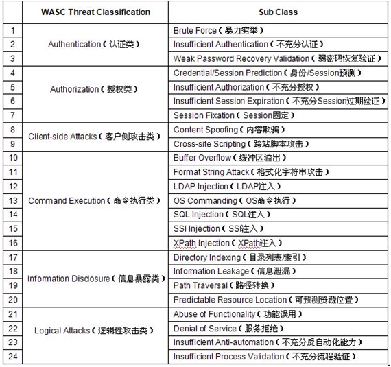
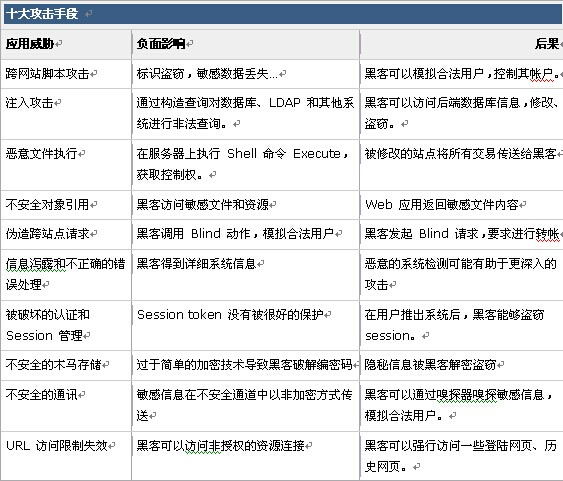
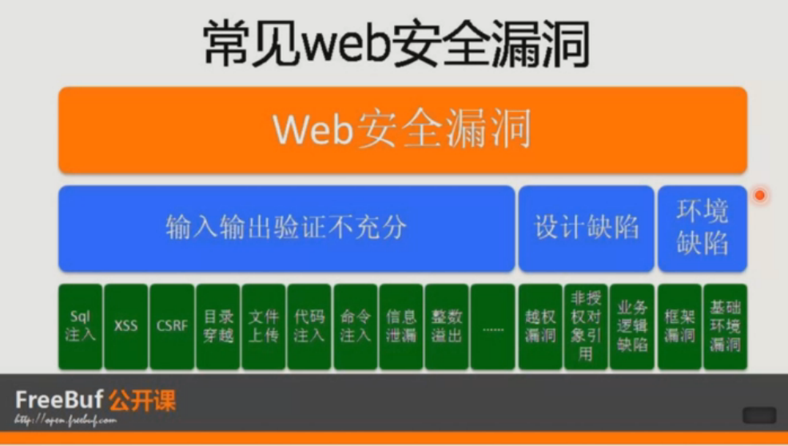

============
前言
============

先来看看一些概念吧，也好有一个直观的印象

web服务组件的构成
-------------------

一图纵览 web 层次组件：

.. image:: ../_images/web_component.png

web 安全威胁的分类
----------------------

一图纵览 web 安全威胁：

十大web威胁
----------------------

web常见漏洞产生原因分类
----------------------------

